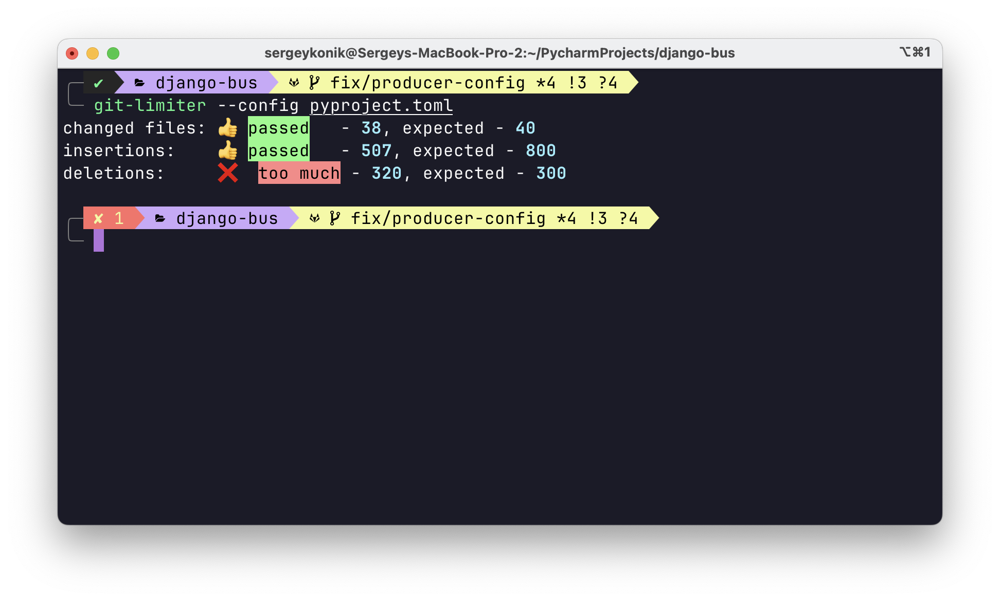
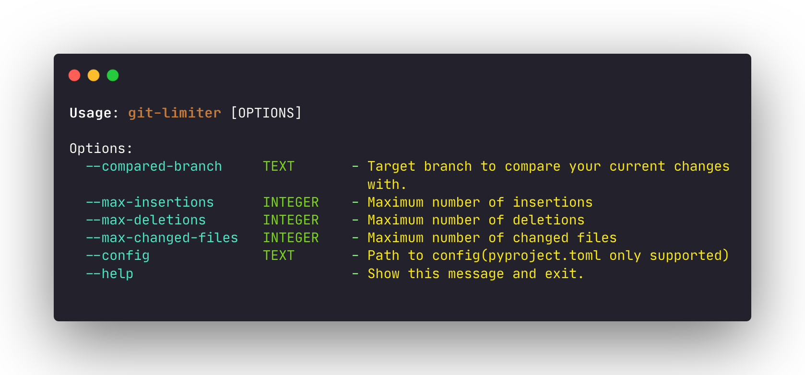

# Getting started

`git-limiter` is a tool comparing your git diff changes with another branch(`develop`, `main`, whatever).

For example, it might be useful if you  want to limit yourself in pushing diffs bigger than 500 insertions/deletions, etc. 

## Installation


Using pip:

```
pip install git-limiter
```


Using poetry:

```
poetry add git-limiter --group dev
```

## Usage

```
git-limiter --max-deletions 400 --max-insertions 600 --max-changed-files 40
```

Or using `pyproject.toml` as config:

```
git-limiter --config pyproject.toml
```

<figure markdown>
  
  <figcaption>Available arguments</figcaption>
</figure>


<figure markdown>
  
  <figcaption>Available arguments</figcaption>
</figure>